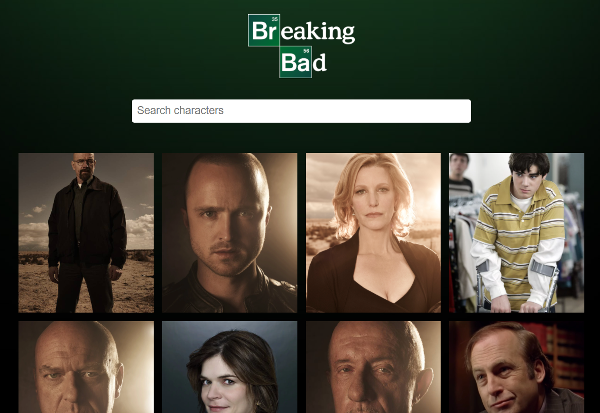
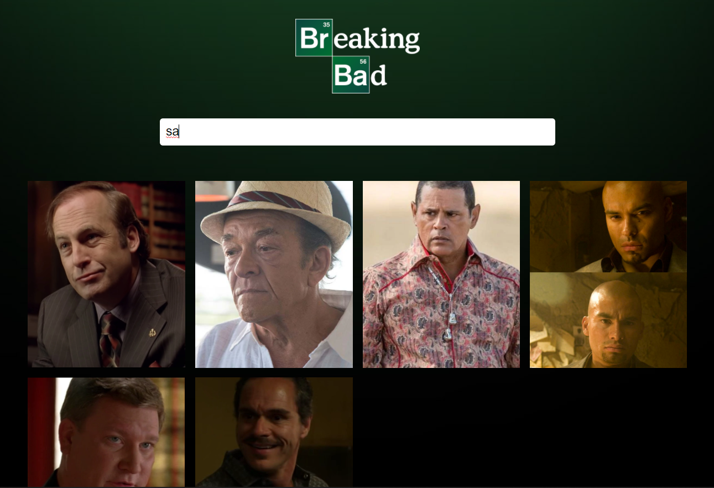

# React-TV-Show-Cast-App

React TV Show Cast App

<!-- Live link to deployed app -->

Repository: https://github.com/Mdudzik92/TV-Show-API 
Deployed app: https://dudzik-tv-show-react-api.herokuapp.com/

<!-- Technologies used -->

JavaScript, ES6, React.JS, React Hooks, JSX, CSS Grids

<!-- Explanation of what the app is -->

This is an app built with React.JS that utilizes the 'Breaking Bad' TV Show API from https://breakingbadapi.com. The app uses a search bar that filters the characters by the user input. The user can start typing in the name of a character, such as typing the letter 'e', and all characters with the letter 'e' in their name will be shown in a nice grid.

<!-- Screenshot -->

<!-- License -->

MIT

<!-- Contact information -->

Email: mdudzik92@gmail.com
